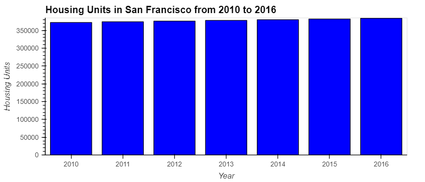
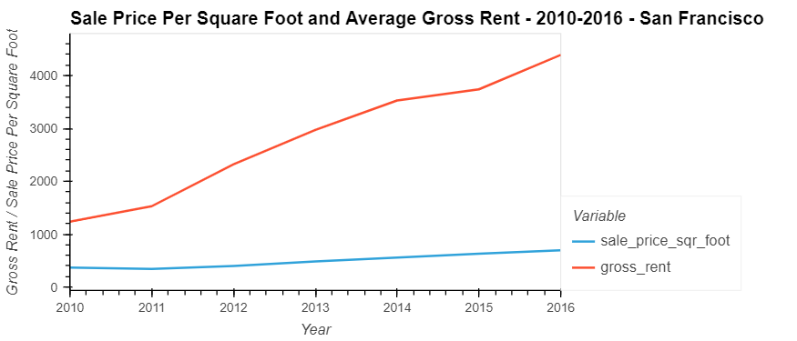
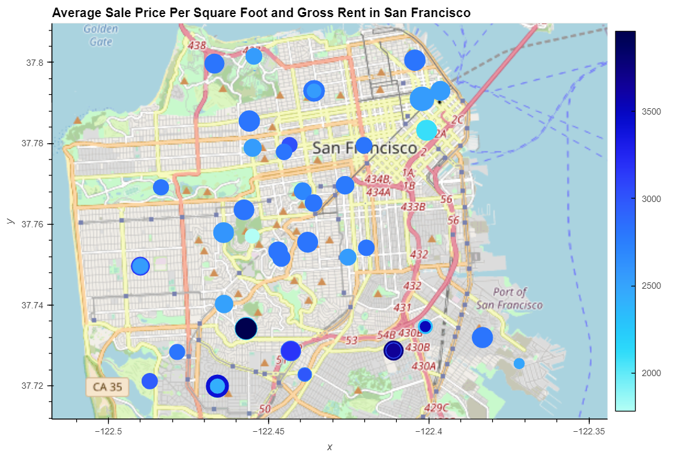

# Pyviz_demo
## Data from the San Fransisco housing market (2010-2016) is visualized to investment opportunities 
### Plotting total housing units

### Plotting sale price/sqft vs average rent price

### Plotting sale price/sqft vs average rent price by specific neighborhood

### Plotting price data with geospatial data
